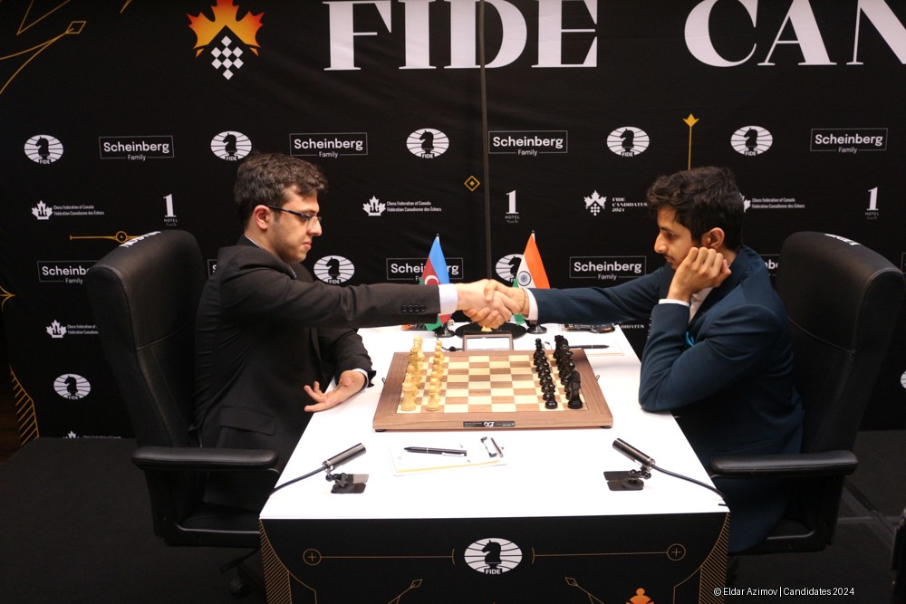
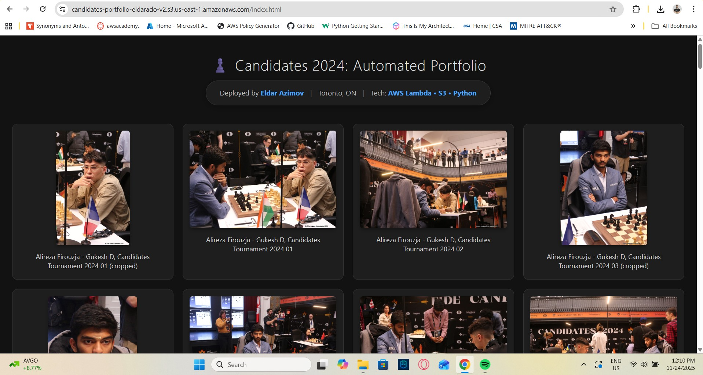

# ♟️ Serverless Event Photographer Pipeline

## Project Overview
Processing high-resolution event photography manually is slow and unscalable. For the **FIDE Candidates Tournament 2024**, I built a fully automated **Event-Driven Serverless Pipeline** on AWS.

The system automatically ingests photos from a source (Wikimedia Commons), resizes them for the web, applies a copyright watermark, stores metadata in a NoSQL database, and publishes them to a static portfolio website—**all in under 2 seconds per photo.**

> **Note on Data Source:** All images processed in this project are my own original work, which I captured personally at the event and contributed to Wikimedia Commons.

### Architecture

**The Workflow:**
1.  **Ingestion Engine:** A Python script scrapes raw images from the tournament source and uploads them to an **S3 Raw Bucket**.
2.  **Event Trigger:** S3 notifications trigger an **AWS Lambda** function.
3.  **Processing (The Core):**
    * **Compute:** Lambda (Python 3.9) processes the image in-memory.
    * **Library:** Custom **Pillow (PIL)** Lambda Layer for image manipulation.
    * **Logic:** Resizes to 1000px and draws a dynamic "© Eldar Azimov" watermark.
4.  **Storage:** Optimized images are saved to a public **S3 Portfolio Bucket**.
5.  **Data Persistence:** Image metadata (URL, Size, Date) is logged to **Amazon DynamoDB**.
6.  **Frontend:** A static HTML/JS website fetches and displays the gallery dynamically.

---

## Technical Challenges & Solutions
*Real problems I solved during development:*

### 1. The "Configuration Overlap" Error
**The Issue:** I initially tried to create multiple triggers for the same S3 bucket events, leading to a "Configurations overlap" error where S3 refused to fire the Lambda.
**The Fix:** I learned that S3 allows only one notification configuration per event type. I consolidated the triggers and cleared the resource-based policy in Lambda to reset the permission link.

### 2. Lambda Layer Compatibility
**The Issue:** AWS Lambda does not include image processing libraries by default. My initial attempts failed because the local Python version (3.12) didn't match the Lambda runtime (3.9).
**The Fix:** I used **AWS CloudShell** to build a Docker-compatible Lambda Layer specifically for Python 3.9, zipped it, and attached it to the function to resolve the `ModuleNotFoundError`.

### 3. Handling URL Encoding
**The Issue:** Files with special characters (like `%2C` for commas) broke the frontend display because of double-encoding between S3 and the browser.
**The Fix:** Implemented `urllib.parse.unquote_plus` in the Lambda to decode keys before processing, and added JavaScript decoding logic in the frontend to display human-readable captions.

---

## Tech Stack
* **Cloud Provider:** Amazon Web Services (AWS)
* **Storage:** Amazon S3 (Standard Tier)
* **Compute:** AWS Lambda (512MB Memory)
* **Database:** Amazon DynamoDB (On-Demand)
* **Language:** Python 3.9 (Boto3, Pillow)
* **Frontend:** HTML5, CSS3, Vanilla JavaScript

## Screenshots
### The Watermarked Result

### The Automated Gallery

